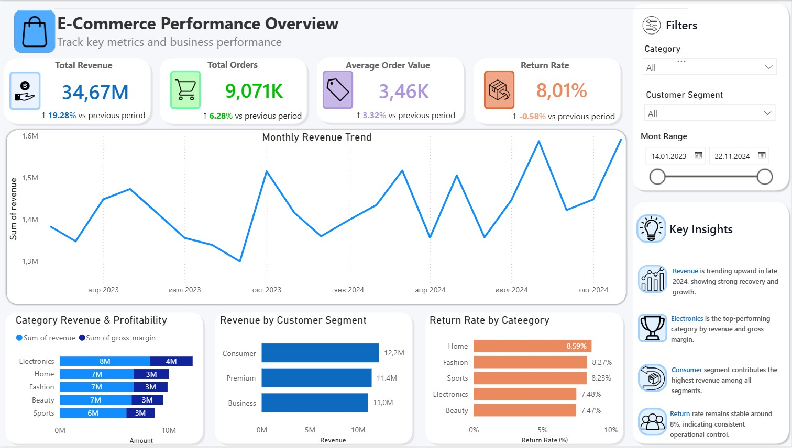

# Retail Intelligence Platform

End-to-end retail analytics platform built with Python, Pandas, SQL, SQLite and Power BI.

This project demonstrates a production-style analytics workflow: synthetic retail data generation, data validation, data cleaning, SQLite loading, SQL analytics views and an interactive Power BI dashboard for business reporting.

---

## Dashboard Preview



---

## Business Problem

Retail and e-commerce teams need reliable reporting to monitor revenue, customer behavior, profitability and operational risks.

This project simulates a retail analytics platform that helps answer key business questions:

- How is revenue changing over time?
- Which product categories generate the most revenue and margin?
- Which customer segments contribute the most sales?
- Which categories have the highest return rate?
- What are the main executive-level business insights?

---

## Features

- Automated ETL pipeline
- Synthetic retail data generation
- Data validation layer
- Data cleaning layer with Pandas
- SQLite database loading
- Analytical SQL views
- KPI monitoring
- Revenue trend analysis
- Customer segmentation
- Category profitability analysis
- Return rate analytics
- Cohort retention analysis
- RFM customer analysis
- Interactive Power BI dashboard
- Executive business insights panel
- Dynamic filtering system

---

## Tech Stack

| Category | Technologies |
|---|---|
| Programming | Python |
| Data Processing | Pandas |
| Database | SQLite |
| Analytics | SQL |
| BI & Visualization | Power BI |
| Version Control | Git & GitHub |

---

## Project Architecture

```text
Synthetic Retail Data
        ↓
Raw CSV Layer
        ↓
Validation Layer
        ↓
Cleaning Layer
        ↓
Processed CSV Layer
        ↓
SQLite Database
        ↓
SQL Analytics Views
        ↓
Power BI Dashboard
```

---

## Project Structure

```text
retail-intelligence-platform/
│
├── data/
│   ├── raw/
│   └── processed/
│
├── images/
│   └── dashboard.jpg
│
├── powerbi/
│   └── retail_dashboard.pbix
│
├── sql/
│   ├── create_tables.sql
│   ├── create_views.sql
│   ├── kpi_queries.sql
│   ├── cohort_retention.sql
│   └── rfm_analysis.sql
│
├── src/
│   ├── cleaner.py
│   ├── create_views.py
│   ├── data_generator.py
│   ├── database.py
│   └── validator.py
│
├── main.py
├── requirements.txt
└── README.md
```

---

## Data Pipeline

The analytics pipeline includes:

1. Generate synthetic retail data
2. Validate raw CSV files
3. Clean raw data with Pandas
4. Save cleaned data into the processed layer
5. Load processed data into SQLite
6. Create SQL analytics views
7. Visualize business KPIs in Power BI

---

## SQL Analytics Layer

The project includes SQL views and analytical queries for:

- Monthly revenue tracking
- Category revenue and gross margin
- Customer segment revenue
- Return rate by category
- Cohort retention analysis
- RFM customer segmentation
- KPI monitoring

The Power BI dashboard is built on top of SQL analytics views instead of raw transactional tables.

---

## Power BI Dashboard

The interactive Power BI dashboard includes:

- Total Revenue KPI
- Total Orders KPI
- Average Order Value KPI
- Return Rate KPI
- Monthly revenue trend
- Category revenue and profitability
- Revenue by customer segment
- Return rate by category
- Category filter
- Customer segment filter
- Date range filter
- Executive insights section

Dashboard file:

```text
powerbi/retail_dashboard.pbix
```

---

## Example Business Insights

Example insights from the dashboard:

- Revenue shows a recovery trend in late 2024.
- Electronics is the strongest category by revenue and gross margin.
- Consumer customers generate the highest revenue among customer segments.
- Return rate remains stable around 8%, indicating controlled operational risk.

---

## Run Project

Install dependencies:

```bash
pip install -r requirements.txt
```

Run the full pipeline:

```bash
python main.py --all
```

This command will:

1. Generate synthetic retail data
2. Validate raw data
3. Clean raw data
4. Load processed data into SQLite
5. Create SQL analytics views

---

## Run Individual Steps

Generate data:

```bash
python main.py --generate
```

Validate data:

```bash
python main.py --validate
```

Clean data:

```bash
python main.py --clean
```

Load data into SQLite:

```bash
python main.py --load
```

Create analytics views:

```bash
python main.py --views
```

---

## Future Improvements

- Add pytest unit tests
- Add GitHub Actions CI pipeline
- Add advanced DAX measures
- Add automated dashboard refresh
- Add Docker containerization
- Add PostgreSQL support
- Add cloud deployment
- Add real-world retail dataset integration

---

## Author

Ruslan Tuliei

GitHub: https://github.com/offANTI